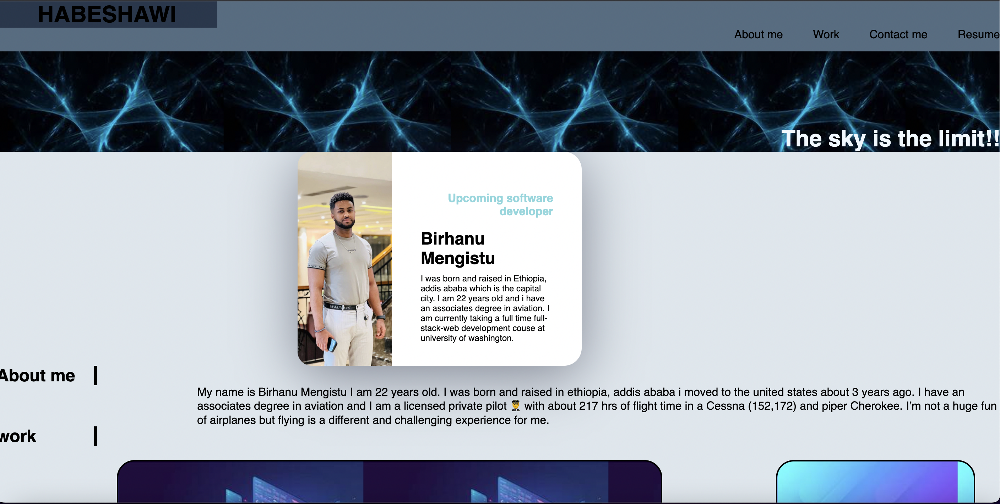

# portfolio

## Description
This a simple portfolio front end website that i made with contents of works that i made linking to the corresponding github pages. 
    
## Screenshot

## Table of Contents
* [Installation](#installation)
* [Usage](#usage)
* [License](#license)
* [Contributors](#contributors)
* [Tests](#tests)
* [Questions](#questions)
    
## Installation
N/A

## Usuage

## License
MIT

## Contributions
Birhanu Mengistu

## Tests
N/A

## Questions

How to reach me:

Github : https://github.com/linotmike

Email : linotmike.mk@gmail.com

## Links

Github repo:  https://github.com/linotmike/Social-network-api

